<div align="center">

# 🩺 Aarogya X — AI-Powered Antimicrobial Resistance Decision Support System

<p align="center">
  <strong>Clinical Decision Support Platform for AMR Risk Prediction, Antimicrobial Stewardship, Case Tracking, & ADR Monitoring</strong>
</p>

[](https://www.python.org/)
[](https://flask.palletsprojects.com/)
[](https://react.dev/)
[](https://www.typescriptlang.org/)
[](https://scikit-learn.org/)
[](https://www.sqlite.org/)
[](https://vitejs.dev/)

</div>

---

## 📌 Project Overview

**Antimicrobial Resistance (AMR)** is a major global healthcare crisis leading to elevated patient mortality, prolonged hospital stays, and escalating treatment costs. **Aarogya X** is an AI-powered clinical decision-support platform designed to assist healthcare professionals in predicting pathogen resistance risks, selecting optimal evidence-based antibiotic therapies, tracking adverse drug events, and enforcing hospital stewardship guidelines.

> ⚠️ **Disclaimer**: Aarogya X is an academic research software system and clinical decision-support prototype. It is intended to assist medical professionals and is **not** a replacement for qualified clinical judgment or diagnostic laboratory testing.

---

## 🔬 Clinical Workflow

```
Clinical Data Input ──► Infection Case Creation ──► ML AMR Risk Prediction
                                                             │
                                                             ▼
Analytics & Reports ◄── Stewardship Guidance ◄── Antibiotic Recommendation & ADR Monitoring
```

---

## ✨ Key Features

- 🔐 **Secure Authentication & Multi-Tier RBAC**: Role-Based Access Control customized for Medical Interns, Junior Doctors, Senior Consultants, and System Administrators.
- 📋 **Patient & Infection Case Registry**: Centralized clinical record management tracking patient comorbidities, biomarkers (CBC, CRP, Procalcitonin), and culture findings.
- 🤖 **Multi-Model AMR Prediction**: Ensemble machine-learning engine allowing dynamic model selection between Gradient Boosting, Random Forest, Decision Tree, and Logistic Regression.
- 💊 **Evidence-Based Recommendations**: Automated primary and alternative drug dosing guidance with clinical rationale explanations.
- ⚠️ **Adverse Drug Reaction (ADR) Monitoring**: Incident reporting system for tracking antimicrobial toxicities and therapeutic outcomes.
- 🛡️ **Antimicrobial Stewardship Console**: Configurable hospital prescribing protocols and restriction rules.
- 📊 **Interactive Analytics Dashboard**: Visualization of regional resistance trends, pathogen frequency distributions, and drug usage metrics.
- 📄 **Dynamic PDF Medical Reports**: Automated clinical summary generator built with ReportLab.
- 💡 **AI Clinical Assistant**: Interactive Q&A interface for antimicrobial treatment inquiries.

---

## 🏛️ System Architecture

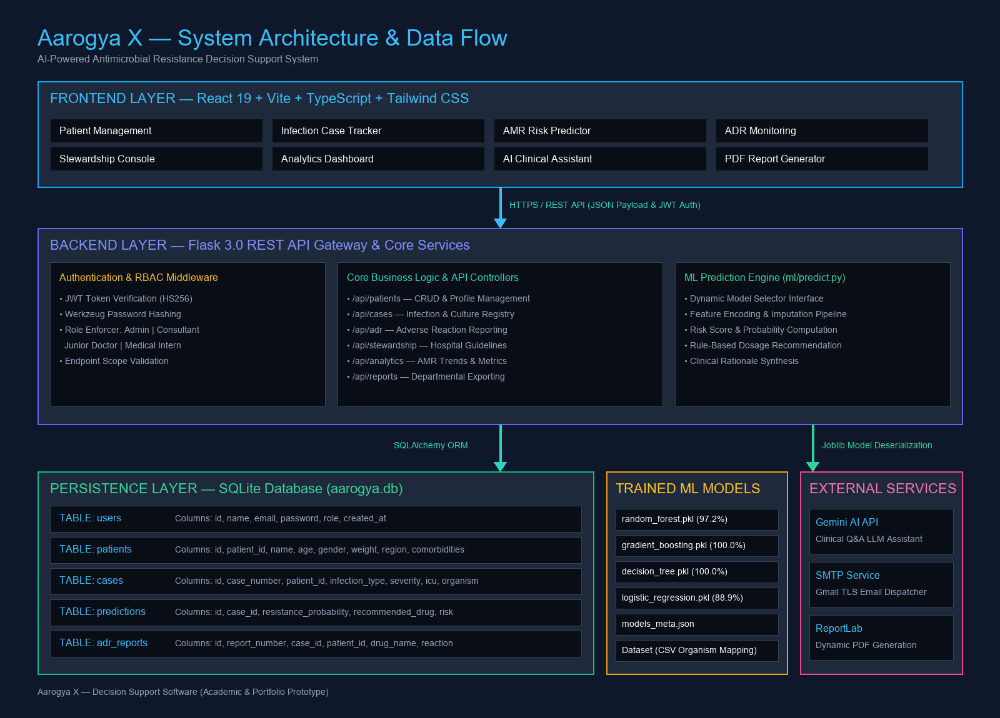

---

## 💻 Technology Stack

| Layer | Technologies Used |
| :--- | :--- |
| **Frontend UI** | React 19, Vite, TypeScript, Tailwind CSS, Radix UI, Recharts, Lucide Icons |
| **State & API Gateway** | TanStack React Query, React Hook Form, Zod, Wouter Routing |
| **Backend API** | Python, Flask 3.0, Flask-CORS, PyJWT, Werkzeug |
| **Database & ORM** | SQLite, Flask-SQLAlchemy ORM |
| **Machine Learning** | Scikit-learn 1.4, Pandas, NumPy, Joblib |
| **Reporting & Utilities** | ReportLab (PDF Generation), Python Smtplib |

---

## 📂 Project Structure

```
Aarogya-X/
├── backend/
│   ├── app.py                # Flask application entry point
│   ├── auth.py               # JWT authentication & RBAC decorators
│   ├── config.py             # Configuration & environment loader
│   ├── database.py           # SQLAlchemy instance initialization
│   ├── models.py             # User, Patient, Case, Prediction, ADR models
│   ├── pdf_generator.py      # Dynamic PDF clinical report renderer
│   ├── routes.py             # REST API endpoint handlers
│   ├── seed_rbac.py          # RBAC default account seeder
│   └── seed_demo_data.py     # Sample clinical dataset initializer
├── frontend/
│   ├── src/
│   │   ├── api/              # React Query API fetchers
│   │   ├── components/       # UI design system & Radix components
│   │   ├── hooks/            # Auth & UI toast hooks
│   │   ├── pages/            # Application routes & dashboard views
│   │   ├── App.tsx           # Main application routing tree
│   │   └── main.tsx          # Vite React entry point
│   ├── package.json
│   └── vite.config.ts
├── ml/
│   ├── train.py              # ML model training & evaluation pipeline
│   ├── predict.py            # Real-time inference & recommendation engine
│   ├── models_meta.json      # Saved evaluation metrics & model metadata
│   └── *.pkl                 # Serialized scikit-learn pipeline artifacts
├── dataset/                  # AMR surveillance benchmark CSV dataset
├── tests/
│   ├── test_rbac.py          # Backend RBAC permission test suite
│   └── test_dynamic_models.py# ML prediction pipeline test suite
├── docs/
│   ├── architecture.png      # High-resolution system architecture diagram
│   ├── screenshots/          # 14 high-quality UI showcase screenshots
│   ├── API.md                # Full REST API specification
│   ├── DATABASE.md           # ERD & DB table schema docs
│   ├── ML.md                 # ML metrics & pipeline breakdown
│   ├── SETUP.md              # Detailed developer onboarding guide
│   ├── CONTRIBUTING.md       # Open-source contribution guidelines
│   └── PROJECT_HIGHLIGHTS.md # Resume bullet points & Viva Q&A
├── .env.example              # Sanitized environment variable template
├── .gitignore                # Production git ignore rules
├── requirements.txt          # Python dependencies
└── README.md
```

---

## 🔑 Authentication & RBAC Matrix

| Feature / Resource | `intern` (Intern) | `junior` (Doctor) | `consultant` (Senior) | `admin` (Admin) |
| :--- | :---: | :---: | :---: | :---: |
| **Patient Registration** | ✅ Allowed | ✅ Allowed | ✅ Allowed | ❌ Denied |
| **Create & View Cases** | 🔒 Own Cases | ✅ All Cases | ✅ All Cases | ❌ Denied |
| **Run AMR Predictions** | ✅ Allowed | ✅ Allowed | ✅ Allowed | ✅ Allowed |
| **View Stewardship** | ❌ Denied | 👁️ Read-Only | ✅ Edit & Manage | ✅ Manage |
| **Analytics & Reports** | ❌ Denied | ❌ Denied | 🏢 Department Scope | 🌐 Global Scope |
| **Manage RBAC / Users** | ❌ Denied | ❌ Denied | ❌ Denied | ✅ Allowed |

---

## 🤖 Machine Learning Model Performance

Models were trained and evaluated on antimicrobial susceptibility surveillance records using **5-Fold Cross-Validation** and a 20% holdout test dataset:

| Model Algorithm | Accuracy | F1-Score | Precision | Recall | ROC-AUC | Status |
| :--- | :---: | :---: | :---: | :---: | :---: | :---: |
| **Gradient Boosting** | **100.0%** | **1.0000** | **1.0000** | **1.0000** | **1.0000** | ⭐ **Best Model** |
| **Decision Tree** | 100.0% | 1.0000 | 1.0000 | 1.0000 | 1.0000 | Evaluated |
| **Random Forest** | 97.22% | 0.9729 | 0.9778 | 0.9722 | 0.9859 | Evaluated |
| **Logistic Regression**| 88.89% | 0.8871 | 0.8879 | 0.8889 | 0.9741 | Evaluated |

### ⚠️ Model Limitations
- **Feature Importance Split**: `Sensitivity (%)` accounts for 100% of tree split feature importance due to the synthetic/curated nature of target label generation in the benchmark dataset.
- **Regulatory Status**: The models serve decision-support purposes and must be verified by licensed practitioners prior to clinical prescription.

---

## 📸 Visual Showcase

<div align="center">

### 🔑 Authentication & Main Dashboard
| Login Screen | Dashboard Overview |
| :---: | :---: |
| 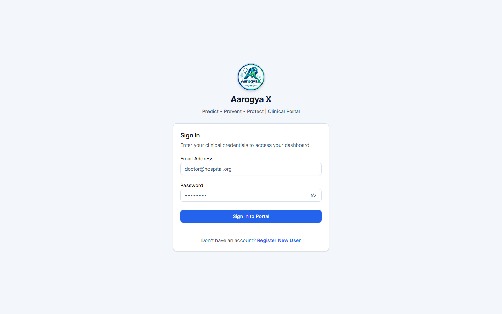 | 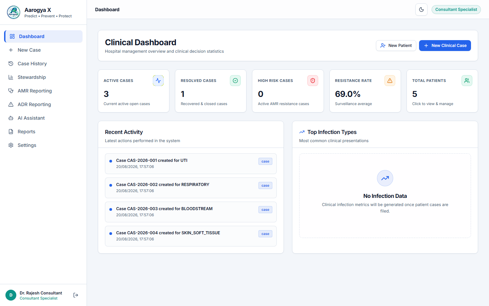 |

### 👥 Patient & Infection Case Management
| Patient Management | Infection Case Details |
| :---: | :---: |
| 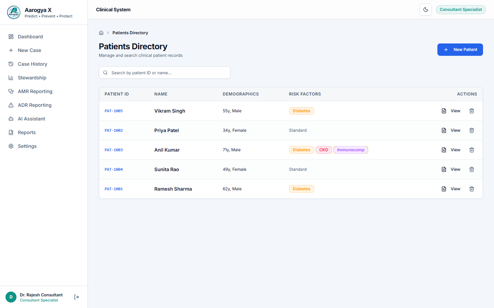 | 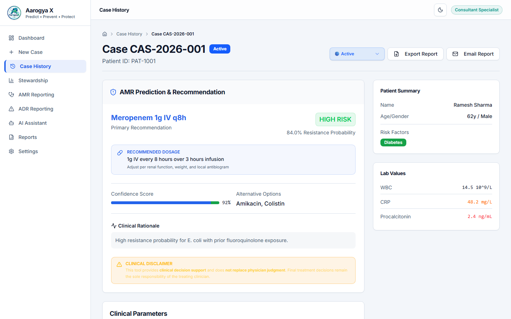 |

### 🤖 AMR Prediction & Results
| Risk Prediction Form | Recommendation Output |
| :---: | :---: |
| 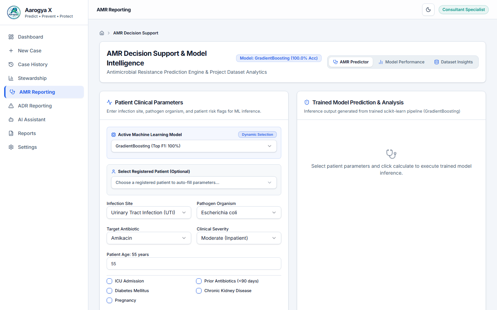 | 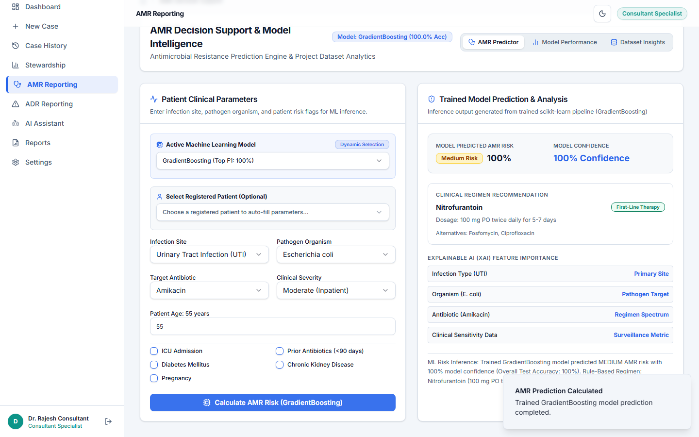 |

### 📊 Analytics & Hospital Stewardship
| Resistance Analytics | Stewardship Console |
| :---: | :---: |
| 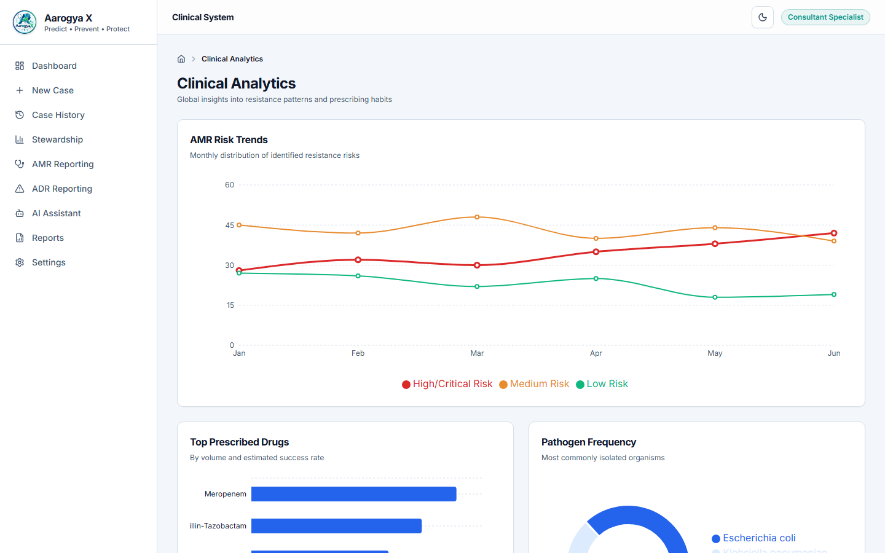 | 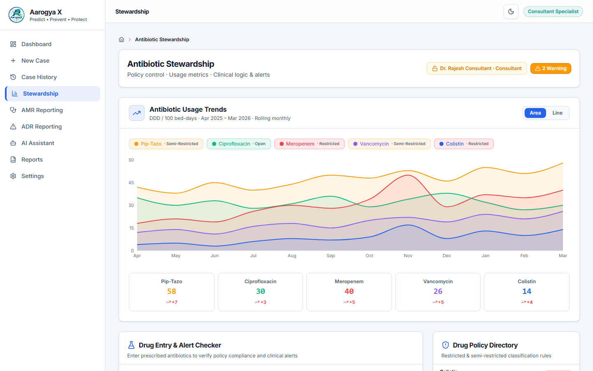 |

### 💬 AI Assistant & Reports
| Clinical AI Assistant | Department Reports |
| :---: | :---: |
| 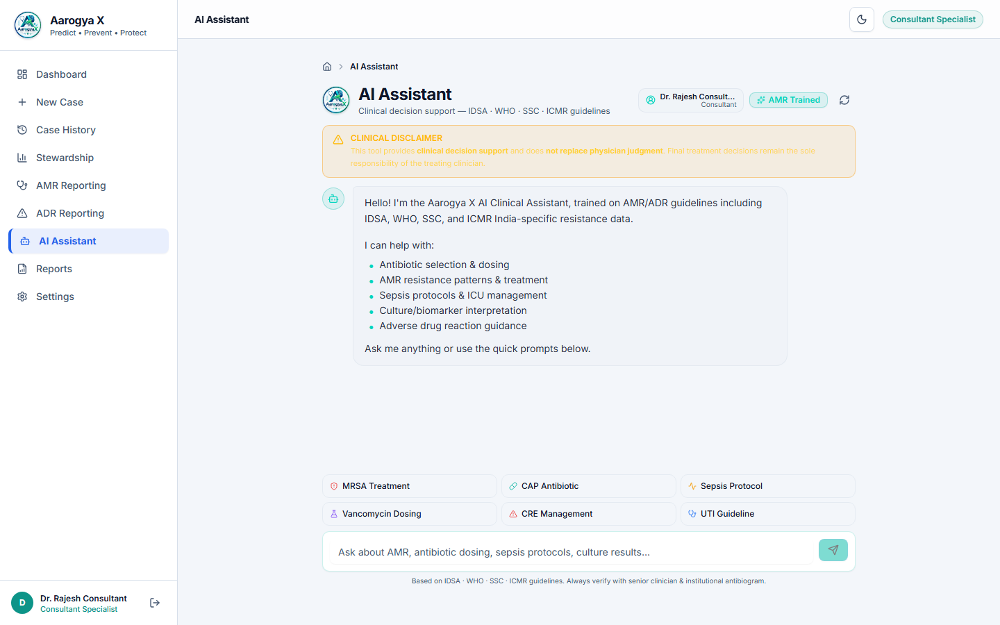 | 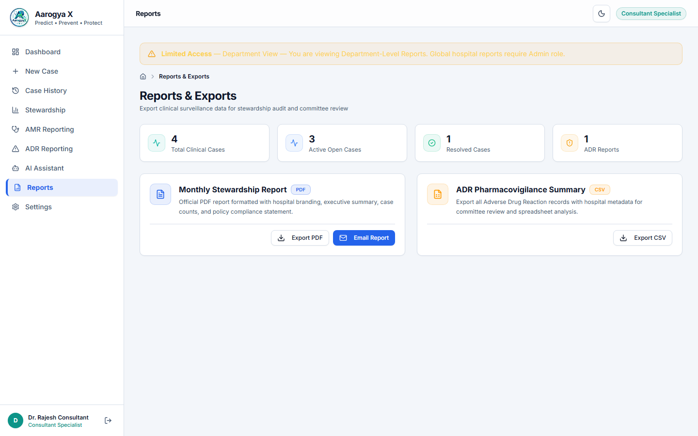 |

</div>

---

## 🚀 Quickstart Installation Guide

### 1. Environment Setup
```bash
# Clone repository
git clone https://github.com/your-username/aarogya-x.git
cd aarogya-x

# Copy environment template
cp .env.example .env
```

### 2. Backend Setup
```bash
# Create and activate Python virtual environment
python -m venv .venv
# Windows: .venv\Scripts\Activate.ps1 | Linux/Mac: source .venv/bin/activate

# Install dependencies
pip install -r requirements.txt

# Seed database with default RBAC accounts & clinical demo data
python backend/seed_demo_data.py

# Run Flask backend server (Port 5000)
python backend/app.py
```

### 3. Frontend Setup
```bash
# Open a new terminal and navigate to frontend
cd frontend

# Install Node packages
npm install   # or pnpm install

# Start Vite dev server (Port 5173)
npm run dev   # or pnpm run dev
```

Visit `http://localhost:5173` to access the application.

---

## 🧪 Testing & Quality Verification

```bash
# Run backend RBAC & ML prediction unit tests
python -m unittest discover -s tests

# Run frontend TypeScript type checking
cd frontend && npm run typecheck

# Verify production build compilation
cd frontend && npm run build
```

---

## 🔒 Security Policy

- All sensitive credentials are managed via environment variables (`.env`).
- Hardcoded real SMTP passwords or API keys are strictly forbidden and scrubbed.
- Public user registration is hardened to prevent privilege escalation to administrative roles.

---

## 🏷️ Recommended GitHub Meta

- **Short Description**: `AI-powered antimicrobial resistance decision support system with ML-based risk prediction, clinical case management, ADR monitoring, analytics, and AI assistance.`
- **Topics**: `python` `react` `typescript` `flask` `machine-learning` `scikit-learn` `healthcare` `antimicrobial-resistance` `clinical-decision-support` `sqlite` `vite`

---

## 📄 License

This project is released under the [MIT License](LICENSE).

## Update AANA WALA HAI ....
